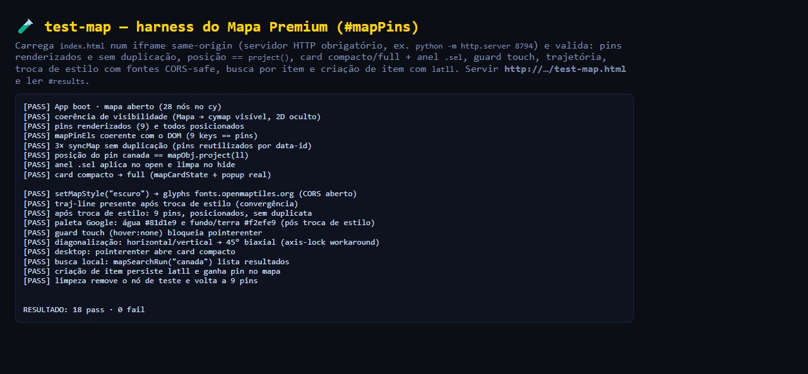
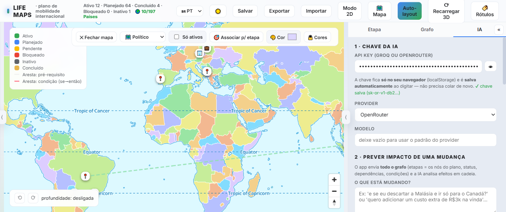

# LifeMaps

An interactive life-planning application focused on international mobility. It expresses a personal plan — phases, country plans, prerequisites, and budget — as a vector graph whose conditional rules are recomputed in real time, and visualizes the result as a 3D globe, a 2D graph, and a premium raster-based map.

The application is distributed as a single-file HTML document. There is no build step and no server-side component; all data is persisted in the browser's local storage and can be exported to JSON.

---

## Features

- **Conditional engine.** `active` / `inactive` states are set manually and are never overwritten. `planned` / `pending` / `blocked` are derived. Rules of the form *"if Plan A is discarded, activate Plan B"* propagate in cascade and revert automatically when the source plan is re-activated.
- **2D graph (Cytoscape.js).** Nodes represent phases, plans, and rules; edges represent prerequisites or conditions.
- **3D globe.** Nodes with a geographic location (`loc`) are positioned on a textured globe by latitude/longitude. Nodes without a location stay on an orbital ring.
- **Premium map (MapLibre GL).** A custom pin layer (`#mapPins`) that cannot duplicate, a phase trajectory layer, a political/region layer, local search plus OpenStreetMap geocoding, item cards, and five base styles (standard, dark, streets, political, satellite) with CORS-safe fonts.
- **Google-Maps-style chrome.** A left navigation drawer (Plan / Your data / Share / Customization / Account), a round account avatar with a dropdown, a top search box with live place/item suggestions that fly the camera to the target, and status chips with counters that filter both the map pins and the 2D graph.
- **Layers picker.** A single square button opens a menu of five illustrative layer cards (Streets / Dark / Roads / Political / Satellite), each with an inline SVG thumbnail, replacing the former dropdown.
- **Map camera clamp.** The camera is bounded horizontally (no empty space beyond ±180°) and vertically (the Arctic/Antarctic cannot dominate the viewport) without relying on `maxBounds`, which is broken in MapLibre GL 3.6.2 when `renderWorldCopies` is disabled.
- **Rich place card.** Clicking a pin opens an animated, rounded card with labelled sections (location, type, reason), status/impact/budget chips, and an image action bar: generate an image with AI (the configured model drafts a visual prompt, a keyless image service renders it, with a Wikipedia fallback), upload your own, or remove it.
- **Location integrity.** A location is the primary, mandatory field of every item. Only valid coordinates produce a pin: `null island` `(0,0)`, `NaN`, and out-of-range values are rejected. Items extracted without a usable location are flagged as incomplete and unchecked by default; unresolvable locations are geocoded at runtime (OpenStreetMap Nominatim) and pinned once resolved.
- **Adaptive layout.** Portrait phones collapse the app into a single column; landscape phones switch to a two-pane layout (side panel + full-height map). Pins stay clickable on both (they sit above the canvas).
- **Configurable trackpad panning.** In the map gear menu you can choose how two-finger drag behaves: native (as sent by the browser — the default), always diagonal (axis-lock workaround), or diagonals only (pure vertical/horizontal gestures are ignored). The choice is stored in the browser.
- **Smooth, flood-free panning.** Wheel events are coalesced into a single camera move per animation frame, so dragging stays fluid even at high zoom while tiles are loading; `overscroll-behavior` is disabled so horizontal swipes never trigger history navigation.
- **Responsive map dragging.** Markers reposition on every camera move frame (no dependency on tiles loading), so items track the map instantly even while zooming.
- **Per-node sub-plan.** Drill-down into a subtree with a breadcrumb trail.
- **Per-node budget.** Cost per step, prerequisite cascade, and a financial summary with live currency conversion (no key required).
- **Structured extraction.** Curated ingestion of video transcripts into typed items (requirements, contacts, job opportunities) with per-type required fields — location is always required.
- **Accounts and cloud sync (Phase 2B).** Email/password registration and sign-in, Google Sign-In, "forgot password" token flow, optional display name, and offline-first document sync (local storage remains the source of truth; the cloud copy is a best-effort backup with conflict detection). A FastAPI + Postgres backend and a login gate back the public deployment.
- **Assistive AI.** Impact prediction and transcript ingestion. The API key (Groq/OpenRouter) is supplied by the user and stored exclusively in the browser; it is never transmitted to an application server.

---

## Running the application

```bash
python -m http.server 8794
# open http://127.0.0.1:8794/index.html
```

The application opens in Map mode when the graph contains geolocated nodes. The 3D globe is entered through the "3D Mode" button.

## Automated test harnesses

| Harness | Command / URL | Result |
|---|---|---|
| Conditional engine | `node test-motor.js` | 13/13 |
| 3D / globe | `http://127.0.0.1:8794/test-3d.html` | 15/15 |
| Premium map | `http://127.0.0.1:8794/test-map.html` | 18/18 |

`test-map.html` cache-busts the application iframe automatically (`app.src='index.html?cv='+Date.now()`), so no stale copy of `index.html` is served. The harness overrides `matchMedia` for both the touch and desktop scenarios, so its result is identical on desktop and mobile-emulated browsers.

The map repaints the existing vector layers with a Google-style palette (water `#81d1e9`, land `#f2efe9`, waterways `#a9d9ec`) with no extra layers or toggles.

## Screenshots

**Premium map — pins and item card** (`FaseE-mapa-premium.png`)


**Google-style palette — water #81d1e9 / land #f2efe9** (`FaseE-paleta-google.png`)



**3D globe** (`test-3d-globo.png`)



---

## Technical stack

Single-file HTML, CSS, and JavaScript. Libraries are loaded from CDNs: [Cytoscape.js](https://js.cytoscape.org/), [three.js](https://threejs.org/), [3d-force-graph](https://github.com/vasturiano/3d-force-graph), and [MapLibre GL JS](https://maplibre.org/maplibre-gl-js/).

## SaaS backend (Phase 2A)

A FastAPI backend scaffold lives in [`backend/`](backend/README.md): document storage per user (`users` + `docs`, JSONB), Google OAuth + password login (Argon2id), httpOnly session cookie, Postgres running in Docker with no public port, and a Caddy reverse proxy with automatic HTTPS. No Supabase dependency — the owner's own Postgres on the VPS is used. Full planning, security checklist and roadmap: `MDs Projects/Lifemaps/PLANO-SAAS-SEGURANCA.md` (local docs folder).

## License

All rights reserved. Do not reuse the code in other projects without prior consent.

---

*Formerly referred to as "Mapa Vetorial Viajens" and "Mental Maps". Folder renamed to "LIFEMAPS  PROJECT" on 2026-09-14.*